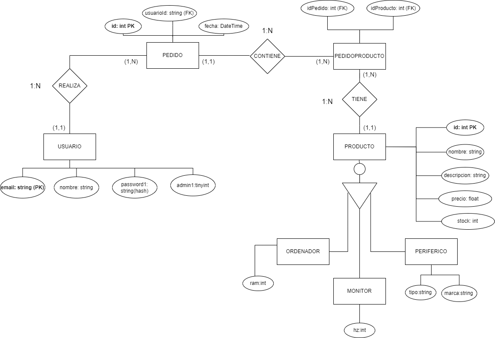
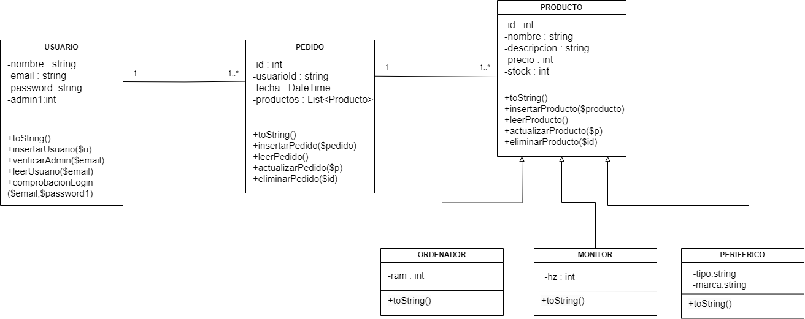

# Tematica de la practica:

EMPRESA DEDICADA A VENTA DE ORDENADORES ONLINE:

La aplicación web será una plataforma de gestión para una empresa de ordenadores.
Permitirá a los usuarios registrados explorar un catálogo de Ordenadores.
Ademas podremos gestionar los usuarios (crear, leer, actualizar y eliminar), y realizar operaciones básicas de administración. El sistema incluirá un registro e inicio de sesión para los usuarios y tambien hemos creado un usuario que podra desde la web eliminar Pedidos y Productos.

# Modelo de Datos (UML de Clases)

UML en el siguiente enlace:

# Modelo Entidad-Relación
Modelo Entidad Relacion en el siguiente enlace:

 PONER RUTA A IMG DEL PROYECTO

# Base de datos utilizada:
CREATE DATABASE DWES_P3_LuisJ_AlejandroN;
USE DWES_P3_LuisJ_AlejandroN;

CREATE TABLE Usuario (
    email VARCHAR(255) PRIMARY KEY,
    nombre VARCHAR(100) NOT NULL,
    password1 VARCHAR(255) NOT NULL,
    admin1 TINYINT(1) NOT NULL DEFAULT 0
);

CREATE TABLE Pedido (
    id INT AUTO_INCREMENT PRIMARY KEY,
    usuarioId VARCHAR(255),
    fecha DATETIME,
    FOREIGN KEY (usuarioId) REFERENCES Usuario(email)
);

CREATE TABLE Producto (
    id INT AUTO_INCREMENT PRIMARY KEY,
    nombre VARCHAR(100),
    descripcion VARCHAR(500),
    precio FLOAT,
    stock INT
);

CREATE TABLE PedidoProducto (
    idPedido INT,
    idProducto INT,
    PRIMARY KEY (idPedido, idProducto),
    FOREIGN KEY (idPedido) REFERENCES Pedido(id),
    FOREIGN KEY (idProducto) REFERENCES Producto(id)
);

SELECT * FROM pedidoproducto;
SELECT * FROM usuario;
SELECT * FROM producto;
SELECT * FROM pedido;

